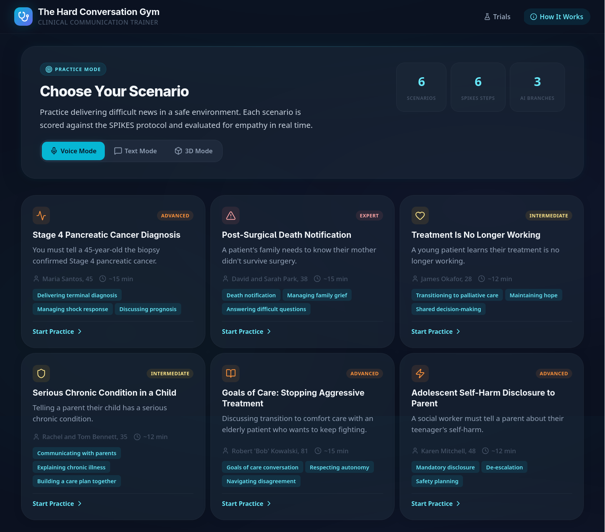
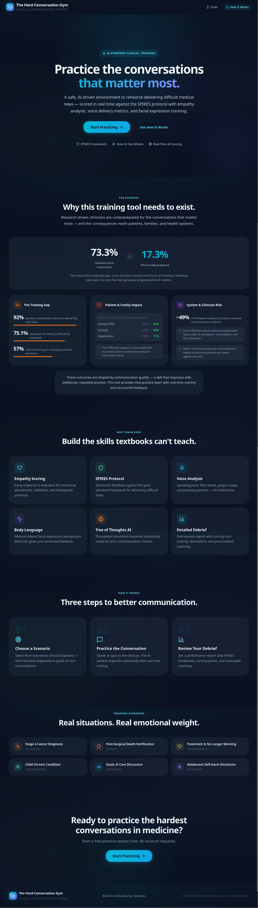
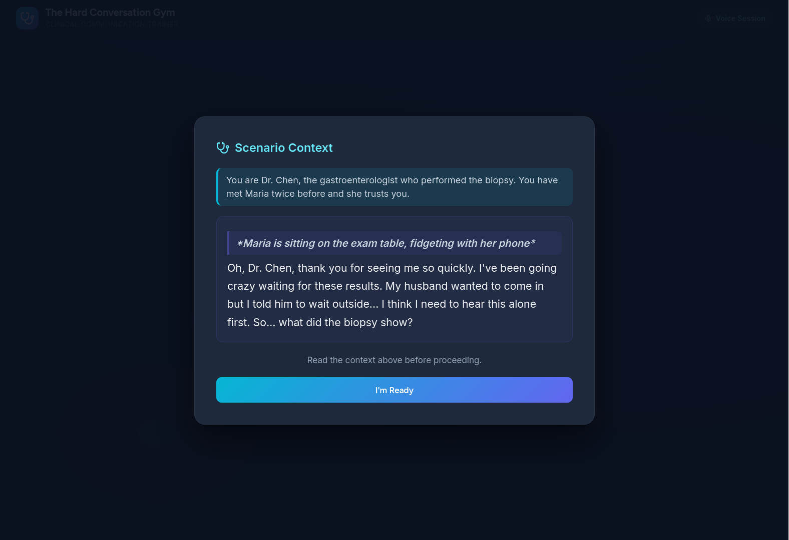
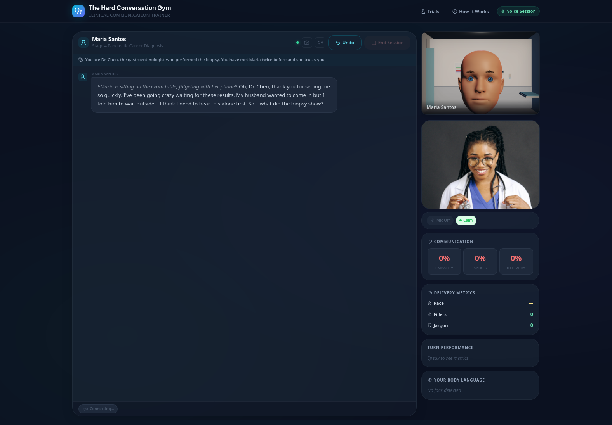

# The Hard Conversation Gym

AI-powered clinical communication trainer that helps medical students, nurses, residents, and social workers practice delivering difficult news using a Tree of Thoughts (ToT) architecture.



## Motivation

Breaking bad news is one of the most consequential skills in clinical medicine, yet trainees consistently report feeling unprepared despite formal instruction. The research paints a stark picture:

- **73.3%** of medical students reported some formal instruction on breaking bad news, but **only 17.3% felt prepared** — and **92% wanted a dedicated course** (Santos et al., 2025).
- **75.1%** of late-stage medical students in a national survey did not feel sufficiently prepared, and **86.3% wanted more training time**. The authors note that controlled training environments limit transfer to real-life situations (Lenkiewicz et al., 2022).
- **35.5%** of residents reported **no training at all** in breaking bad news; **57% had no training** in dealing with patient emotions (Mansoursmaei et al., 2023).
- Across 40 countries, **only ~33%** of ICU clinicians reported formal training in delivering bad news (Alshami et al., 2020).

The consequences of inadequate delivery are not just interpersonal — they are measurable and clinical:

- Suboptimal affective communication significantly **increases patient anxiety** (Cohen's d ~ 0.70) and **uncertainty** (d ~ 0.53), while **reducing information recall** (van Osch et al., 2014; Sep et al., 2014).
- The absence of effective end-of-life discussions is associated with **higher rates of mechanical ventilation** (OR 0.26), **resuscitation** (OR 0.16), and **ICU admission** (OR 0.35) — and **lower hospice enrollment** (Wright et al., 2008).
- Aggressive care patterns near death are associated with **worse patient quality of life** and **higher odds of major depressive disorder** in bereaved caregivers (adjusted OR 3.37) (Wright et al., 2008).
- **Communication failures appear in ~49% of malpractice claims** and are associated with substantially higher case costs (~$238k vs ~$154k) (CRICO Benchmarking Report).

Existing simulation-based training uses standardized patients, but these are expensive, scarce, and difficult to scale. A 2021 systematic review found wide variation in simulated patient models and a **lack of high-quality evidence comparing different training formats**. The Hard Conversation Gym exists to bridge this gap — providing realistic, on-demand practice with AI patients who respond authentically to empathy, communication style, and clinical framing.

## Purpose

The Hard Conversation Gym provides a safe, repeatable environment for clinicians-in-training to:

1. **Practice high-stakes conversations** — terminal diagnoses, death notifications, treatment failures, goals of care — without risk to real patients.
2. **Receive structured feedback** scored against the evidence-based SPIKES protocol (Baile et al., 2000) and evaluated for empathy in real time.
3. **Build the skills textbooks can't teach** — managing unpredictable emotions, sitting with silence, delivering a warning shot, and discussing next steps with compassion.
4. **Replay and reflect** — review turning points in the conversation, understand where the dialogue shifted, and practice again from any branching point.



## How It Works

1. **Choose a scenario** - Select from 6 clinical situations (terminal diagnosis, death notification, treatment failure, etc.)
2. **Practice the conversation** - Chat with an AI patient who reacts authentically to your communication style
3. **Review your debrief** - Get scored on the SPIKES framework and empathy, with specific feedback and the ability to replay from any turning point





### Tree of Thoughts Engine

Behind every conversation turn, the ToT engine:
- Generates 3 branching patient responses (defensive, grieving, questioning)
- Scores your utterance against the SPIKES protocol
- Selects the most realistic branch based on your empathy level
- Tracks turning points where the conversation shifted positively or negatively
- Builds a full conversation tree for debrief analysis

### SPIKES Framework

Each utterance is scored against the 6-step SPIKES protocol for breaking bad news:
- **S**etting - establishing privacy and comfort
- **P**erception - assessing what the patient knows
- **I**nvitation - asking how much info they want
- **K**nowledge - delivering news with a warning shot
- **E**motions - acknowledging feelings, allowing silence
- **S**trategy - discussing next steps

## Quick Start

### Prerequisites
- Python 3.11+
- Node.js 18+
- DeepSeek API key

### Setup

```bash
# Clone and set up API key
cp .env.example .env
# Edit .env and add your DEEPSEEK_API_KEY

# Backend
cd backend
pip install -r requirements.txt
uvicorn main:app --reload --port 8000

# Frontend (new terminal)
cd frontend
npm install
npm run dev
```

Open http://localhost:3000

## Tech Stack

- **Frontend**: React + Vite
- **Backend**: Python FastAPI
- **AI**: DeepSeek API (deepseek-chat)
- **Architecture**: Tree of Thoughts with DFS + backtracking

## Scenarios

| Scenario | Difficulty | Description |
|----------|-----------|-------------|
| Stage 4 Pancreatic Cancer | Advanced | Tell a 45-year-old teacher her biopsy confirmed terminal cancer |
| Post-Surgical Death | Expert | Notify a family their mother didn't survive surgery |
| Treatment Failure | Intermediate | Tell a 28-year-old his immunotherapy stopped working |
| Child Chronic Condition | Intermediate | Tell parents their 7-year-old has Type 1 diabetes |
| Goals of Care | Advanced | Discuss stopping treatment with a stubborn 81-year-old veteran |
| Adolescent Self-Harm | Advanced | Tell a parent about their teenager's self-harm |

## References

1. Santos, M. et al. (2025). "From classroom to clinic." Medical student survey on breaking bad news preparedness. [Link](https://d-nb.info/1368159796/34)
2. Lenkiewicz, K. et al. (2022). National survey of medical students on breaking bad news preparedness. *International Journal of Environmental Research and Public Health*, 19(5), 2622. [Link](https://www.mdpi.com/1660-4601/19/5/2622)
3. Mansoursmaei, M. et al. (2023). Resident self-assessment of breaking bad news skills. *BMC Medical Education*. [Link](https://pubmed.ncbi.nlm.nih.gov/35188927/)
4. Alshami, A. et al. (2020). Multinational ICU survey on breaking bad news training. *Healthcare*, 8(4). [Link](https://pdfs.semanticscholar.org/bb16/0d162c5037f9e39b6d95701d10aeedceb31f.pdf)
5. van Osch, M. et al. (2014). Effect of affective communication on anxiety, uncertainty, and recall in bad-news consultations. *Psycho-Oncology*. [Link](https://postprint.nivel.nl/PPpp4993.pdf)
6. Sep, M. et al. (2014). Physiological arousal and information recall in bad-news consultations. *Psycho-Oncology*. [Link](https://postprint.nivel.nl/PPpp4803.pdf)
7. van Vliet, L. et al. (2013). Effects of prognostic explicitness and reassurance on uncertainty, anxiety, self-efficacy, and satisfaction. *Patient Education and Counseling*. [Link](https://postprint.nivel.nl/PPpp4663.pdf)
8. Wright, A. et al. (2008). Associations between end-of-life discussions, patient mental health, medical care near death, and caregiver bereavement adjustment. *JAMA*, 300(14), 1665-1673. [Link](https://jamanetwork.com/journals/jama/fullarticle/182700)
9. Back, A. et al. (2007). Oncotalk: Efficacy of a communication skills training program for oncology fellows. *JAMA Internal Medicine*. [Link](https://jamanetwork.com/journals/jamainternalmedicine/fullarticle/769642)
10. Lautrette, A. et al. (2007). A communication strategy and brochure for relatives of patients dying in the ICU. *New England Journal of Medicine*. [Link](https://medschool.cuanschutz.edu/docs/librariesprovider60/education-docs/heartbeat-im-res/suggested-read/ab-endoflife%2812%29.pdf)
11. CRICO Strategies. Communication benchmarking in malpractice claims. [Link](https://ahpo.net/assets/crico_benchmarking_communication.pdf)
12. Baile, W. et al. (2000). SPIKES — A six-step protocol for delivering bad news. *The Oncologist*, 5(4), 302-311.
13. National Coalition for Hospice and Palliative Care. *Clinical Practice Guidelines for Quality Palliative Care*, 4th Edition. [Link](https://www.nationalcoalitionhpc.org/wp-content/uploads/2020/07/NCHPC-NCPGuidelines_4thED_web_FINAL.pdf)
14. Monrouxe, L. et al. (2014). How prepared are UK medical graduates for practice? *GMC-commissioned final report*. [Link](https://www.gmc-uk.org/-/media/gmc-site/about/how-prepared-are-uk-medical-graduates-for-practice.pdf)
